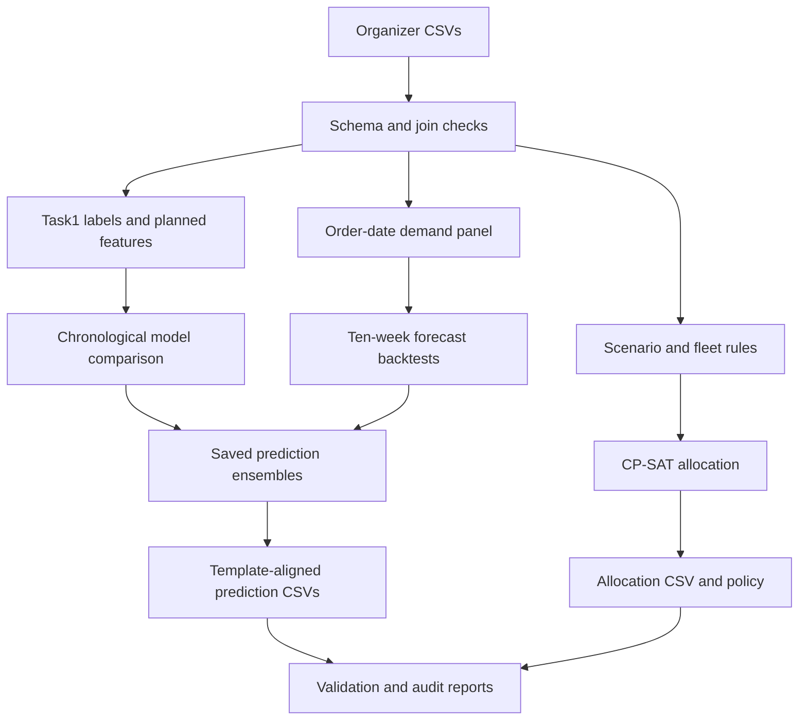

# Model architecture and proposed deployment

Training is a local batch job. Task1 and Task2A final models are serialized with their fitted preprocessing and ensemble weights. Allocation is a separate deterministic constraint model with time-limited optimization, explicit status and bounds.

Proposed deployment: run the saved Task1 models after the order cutoff once planned routes and current road inputs are available. Run demand forecasts as a weekly batch using only observations available at that date. Send predictions to a dispatcher application, retain input/model versions, and monitor service error, lateness calibration and demand error by brand/depot. Use observed new outcomes only in a later retraining batch. This proposal is documented; no HTTP service or live logistics integration is claimed in this deliverable.
